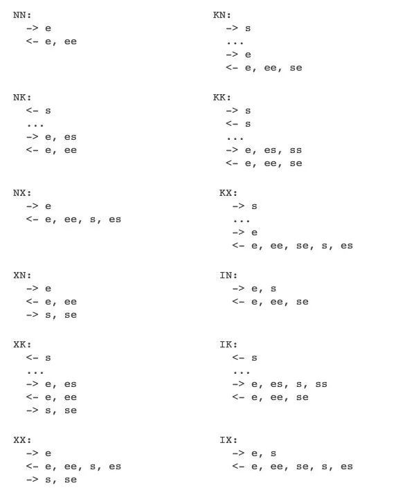

# cryptography 密码学

- ~~现代加密通信协议一般都有四个部分：~~
  - ~~设计决策点：四类基础算法 加密/MAC/签名/密钥交换 如何选择？~~

- ~~这里使用认证加密算法: ChaCha20-ploy1305~~
- ~~ECDH 交换~~

## 参考 Noise 协议

- Noise 协议握手细节
  Noise 协议的核心部分是握手协议，它总共支持 12 种不同的协商的模式。这些模式可以进一步和 PSK，非对称加密算法，对称加密算法，哈希算法排列组合出数百种不同的协议变量。当然，核心就是这 12 种。每个模式都由两个字母标识，第一个字母代表发起者，第二个字母代表应答者：

- N：表示自己没有固定公私钥
- K：表示自己的固定公钥对方预先知道（通过其他途径）
- X：表示自己的固定公钥通过网络加密传输给对方（用于身份隐藏）
- I：表示自己的固定公钥明文传输给对方（不考虑身份隐藏），I 状态只会出现在发起端

 

## 一些简称解释

- PBKDF2 (Password Based Key Derivation Function 2)
- AEAD (Authenticated encryption with associated data)
- HMAC (哈希信息验证码(Hash Message Authentication Code))
